---
## Front matter
lang: ru-RU
title: "Лабораторная работа №1"
subtitle: Основы информационной безопасности.
author:
  - Калашникова Ольга Сергеевна
institute:
  - Российский университет дружбы народов, Москва, Россия
date: 14 декабря 2024

## i18n babel
babel-lang: russian
babel-otherlangs: english

## Formatting pdf
toc: false
toc-title: Содержание
slide_level: 2
aspectratio: 169
section-titles: true
theme: metropolis
header-includes:
 - \metroset{progressbar=frametitle,sectionpage=progressbar,numbering=fraction}
 
## Fonts 
mainfont: PT Serif 
romanfont: PT Serif 
sansfont: PT Sans 
monofont: PT Mono 
mainfontoptions: Ligatures=TeX 
romanfontoptions: Ligatures=TeX 
sansfontoptions: Ligatures=TeX,Scale=MatchLowercase 
monofontoptions: Scale=MatchLowercase,Scale=0.9

---

## Цель работы

Целью данной работы является приобретение практических навыков установки операционной системы на виртуальную машину, настройки минимально необходимых для дальнейшей работы сервисов.

## Установка операционной системы

Перед началом выполнения лабораторной работы, скачиваем необходимый дистрибутив, воспользовавшись сайтом (рис.1).

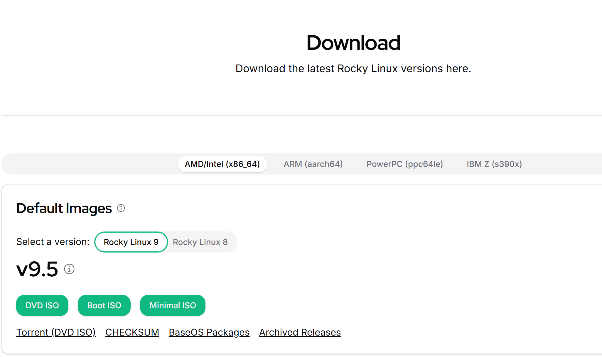{#fig:001 width=40%}

## Установка операционной системы

Открываем VirtualBox и создаём новую виртуальную машину. Указываем имя виртуальной машины, определяем тип операционной системы и указываем путь к iso-образу (рис.2).

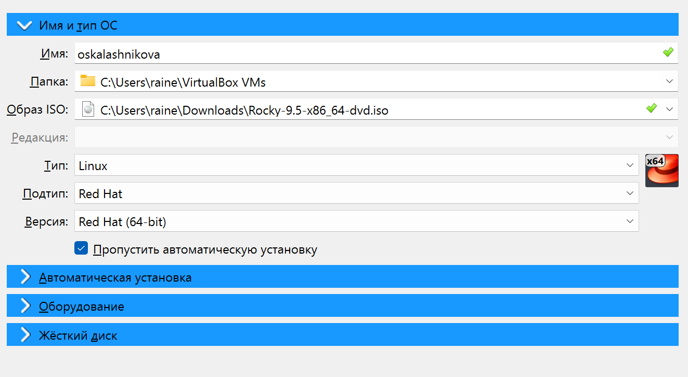{#fig:002 width=40%}

## Установка операционной системы

Указываем объем объём основной памяти - 2048МБ, и количество процессоров - 3 (рис.3).

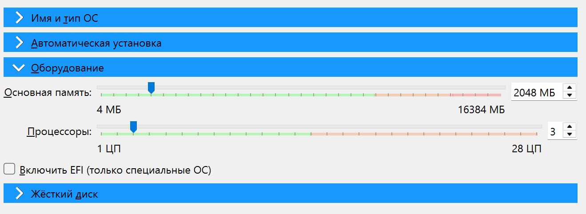{#fig:003 width=40%}

## Установка операционной системы

В размере виртуального жёсткого диска указываем 40 Гб (рис.4).

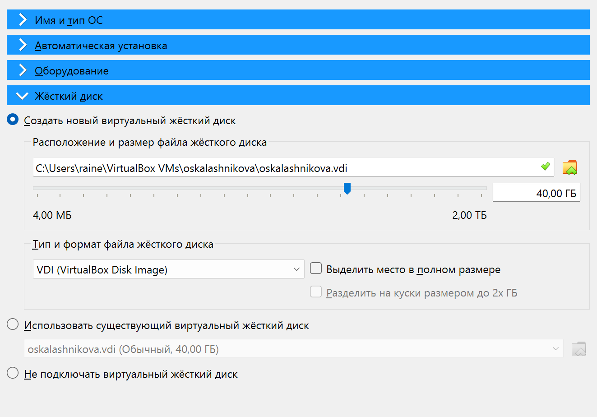{#fig:004 width=40%}

## Установка операционной системы

Запускаем виртуальную машину и выбираем установку Rocky Linux (рис.5).

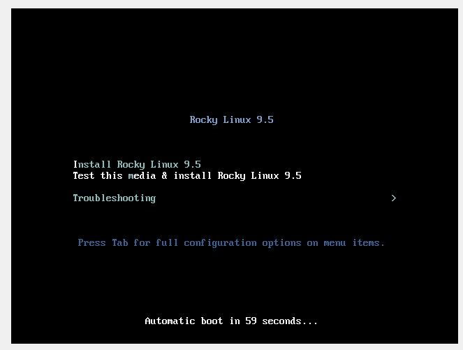{#fig:005 width=40%}

## Установка операционной системы

Переходим к настройкам установки операционной системы и выбираем английский язык для интерфейса (рис.6).

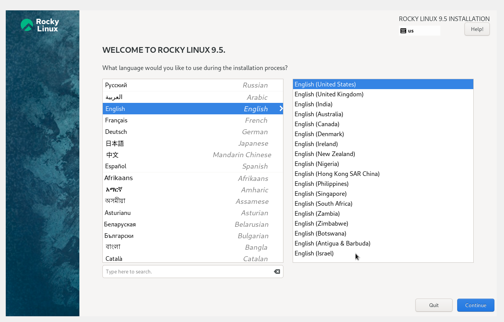{#fig:006 width=40%}

## Установка операционной системы

Добавляем русскую раскладку клавиатуры, меняем клавишу смены языка и проверяем работоспособность (рис.7).

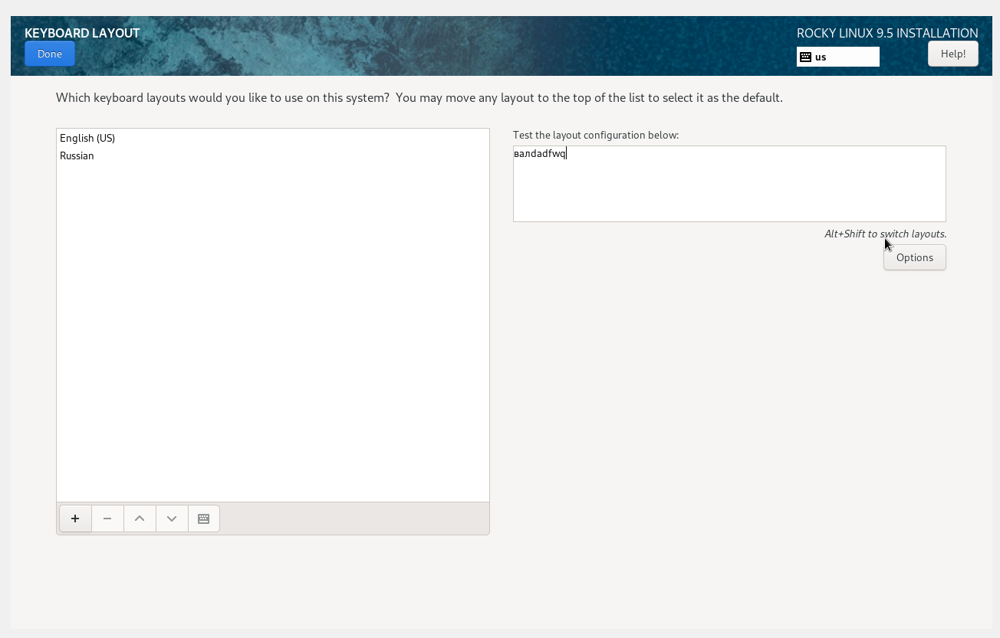{#fig:007 width=40%}

## Установка операционной системы

Проверяем что дата и время выбраны правильно (рис.8).

{#fig:008 width=40%}

## Установка операционной системы

В разделе выбора программ указываем в качестве базового окружения Server with GUI, а в качестве дополнения — Development Tools (рис.9).

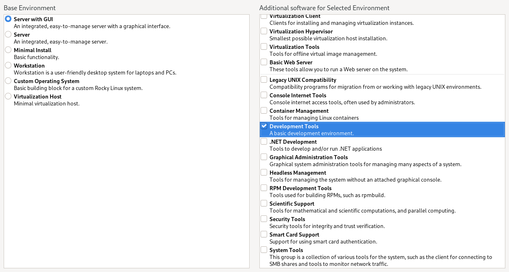{#fig:009 width=40%}

## Установка операционной системы

При выборе места установки оставляем те параметры, которые были выставлены автоматически (рис.10).

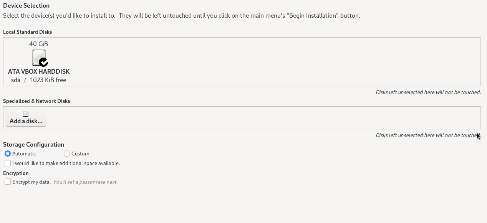{#fig:010 width=40%}

## Установка операционной системы

После этого отключаем KDUMP (рис.11).

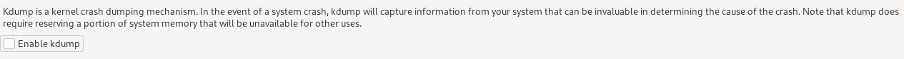{#fig:011 width=40%}

## Установка операционной системы

Подключаем сетевое соединение и в качестве имени узла указываем oskalashnikova.localdomaim (рис.12).

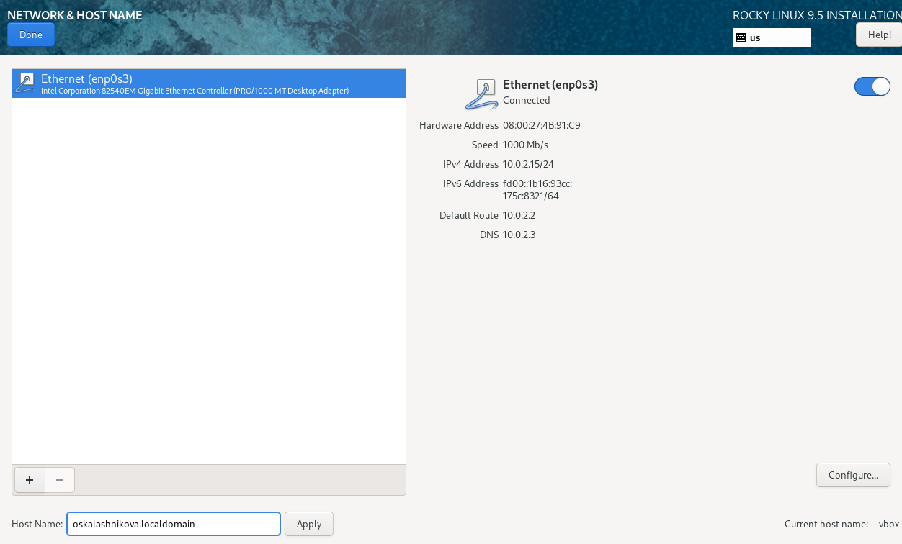{#fig:012 width=40%}

## Установка операционной системы

Устанавливаем пароль для root (рис.13).

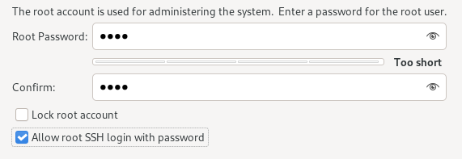{#fig:013 width=40%}

## Установка операционной системы

Устанавливаем пароль для пользователя с правами администратора (рис.14).

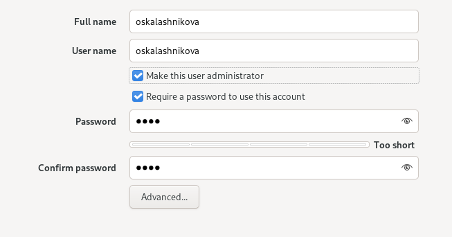{#fig:014 width=40%}

## Установка операционной системы

Проверяем всё ли выполнено и нажимаем начать установку(рис.15).

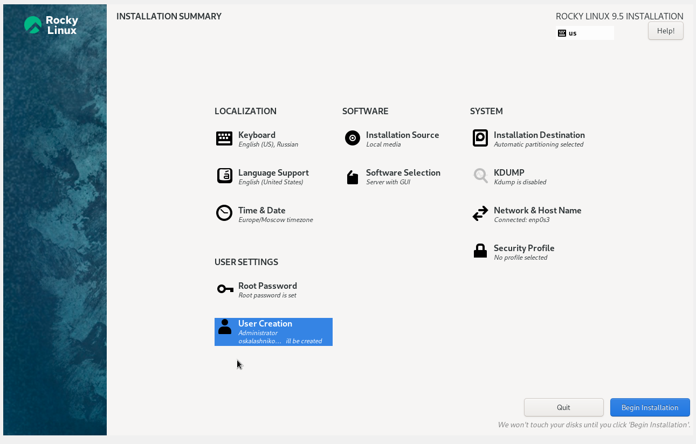{#fig:015 width=40%}

## Установка операционной системы

Устанавливаем ОС (рис.16).

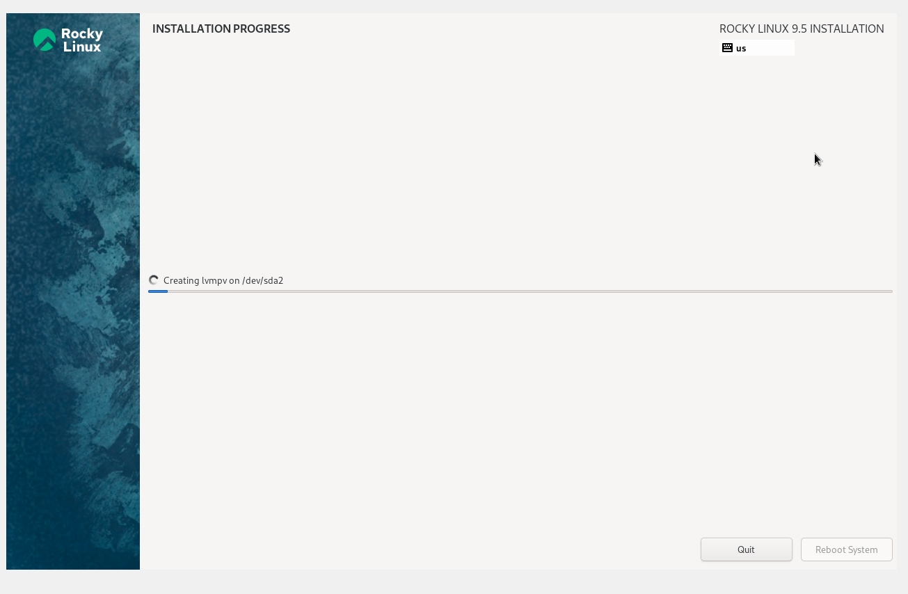{#fig:016 width=40%}

## Установка операционной системы

После успешной установки перезагружаем систему. Вход происходит по паролю который мы задали (рис.17).

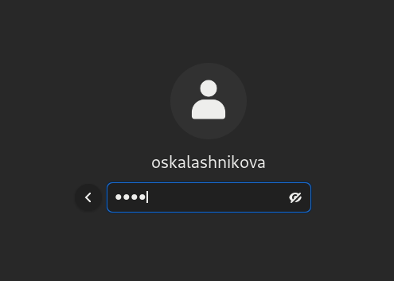{#fig:017 width=40%}

## Установка операционной системы

Проверяем вход в root, всё работает (рис.17).

{#fig:018 width=40%}

## Установка операционной системы

Подключаем образ диска Дополнительной гостевой ОС (рис.19)

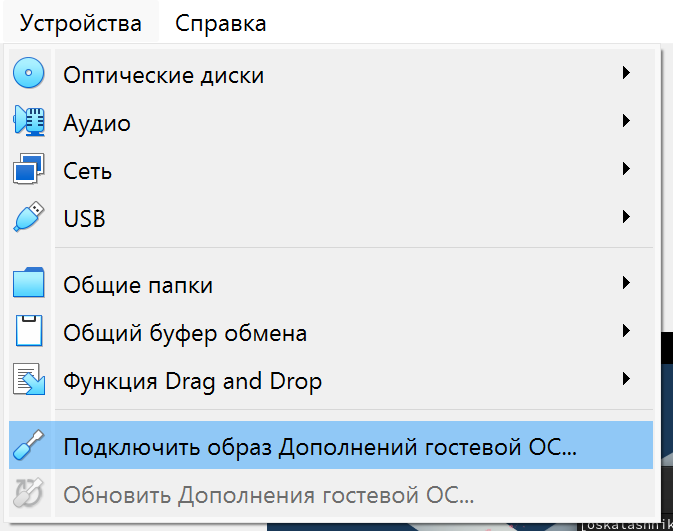{#fig:019 width=40%}

## Выводы

В ходе выполнения лабораторной работы мной были приобретены практические навыки установки операционной системы на виртуальную машину и настройки минимально необходимых для дальнейшей работы сервисов.
