---
## Front matter
title: "Отчёт по лабораторной работе №1"
subtitle: "Дисциплина: Основы информационной безопасности"
author: "Калашникова Ольга Сергеевна"

## Generic otions
lang: ru-RU
toc-title: "Содержание"

## Bibliography
bibliography: bib/cite.bib
csl: pandoc/csl/gost-r-7-0-5-2008-numeric.csl

## Pdf output format
toc: true # Table of contents
toc-depth: 2
lof: true # List of figures
lot: true # List of tables
fontsize: 12pt
linestretch: 1.5
papersize: a4
documentclass: scrreprt
## I18n polyglossia
polyglossia-lang:
  name: russian
  options:
	- spelling=modern
	- babelshorthands=true
polyglossia-otherlangs:
  name: english
## I18n babel
babel-lang: russian
babel-otherlangs: english
## Fonts
mainfont: PT Serif
romanfont: PT Serif
sansfont: PT Sans
monofont: PT Mono
mainfontoptions: Ligatures=TeX
romanfontoptions: Ligatures=TeX
sansfontoptions: Ligatures=TeX,Scale=MatchLowercase
monofontoptions: Scale=MatchLowercase,Scale=0.9
## Biblatex
biblatex: true
biblio-style: "gost-numeric"
biblatexoptions:
  - parentracker=true
  - backend=biber
  - hyperref=auto
  - language=auto
  - autolang=other*
  - citestyle=gost-numeric
## Pandoc-crossref LaTeX customization
figureTitle: "Рис."
tableTitle: "Таблица"
listingTitle: "Листинг"
lofTitle: "Список иллюстраций"
lotTitle: "Список таблиц"
lolTitle: "Листинги"
## Misc options
indent: true
header-includes:
  - \usepackage{indentfirst}
  - \usepackage{float} # keep figures where there are in the text
  - \floatplacement{figure}{H} # keep figures where there are in the text
---

# Цель работы

Целью данной работы является приобретение практических навыков установки операционной системы на виртуальную машину, настройки минимально необходимых для дальнейшей работы сервисов.

# Выполнение лабораторной работы

Перед началом выполнения лабораторной работы, скачиваем необходимый дистрибутив, воспользовавшись сайтом (рис. [-@fig:001]).

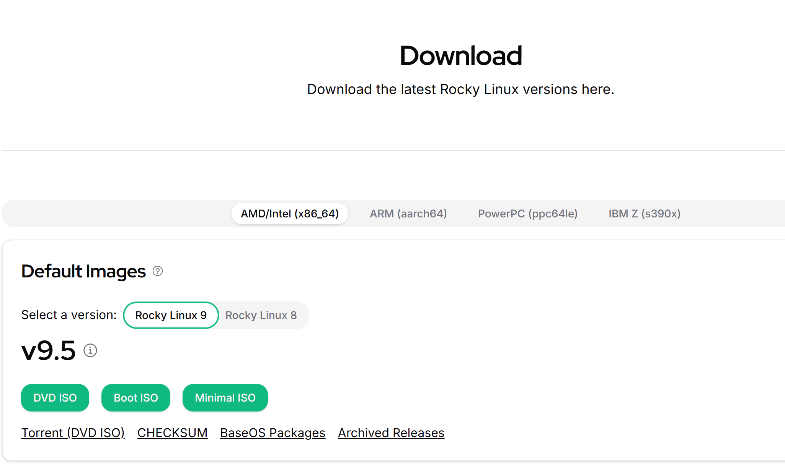{#fig:001 width=70%}

Открываем VirtualBox и создаём новую виртуальную машину. Указываем имя виртуальной машины, определяем тип операционной системы и указываем путь к iso-образу (рис. [-@fig:002]).

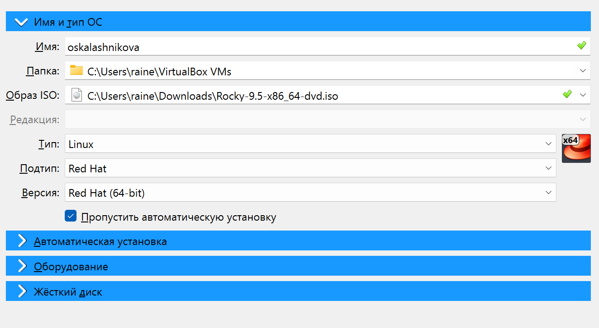{#fig:002 width=70%}

Указываем объем объём основной памяти - 2048МБ, и количество процессоров - 3 (рис. [-@fig:003]).

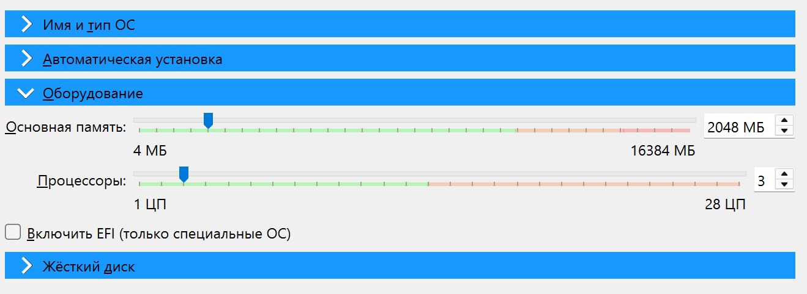{#fig:003 width=70%}

В размере виртуального жёсткого диска указываем 40 Гб (рис. [-@fig:004]).

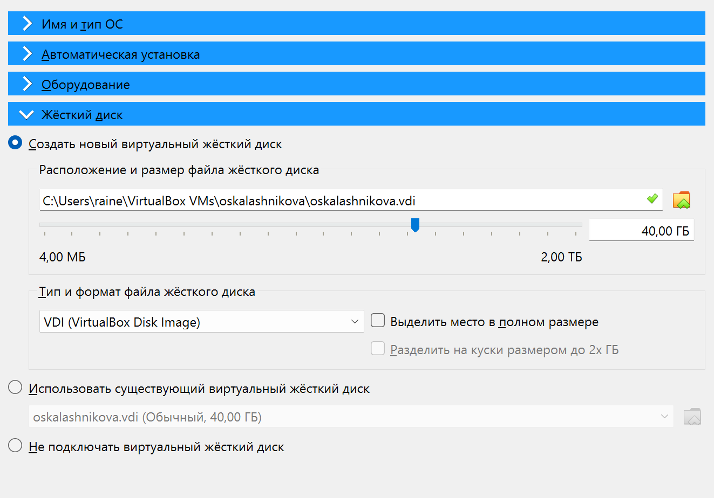{#fig:004 width=70%}

Запускаем виртуальную машину и выбираем установку Rocky Linux (рис. [-@fig:006]).

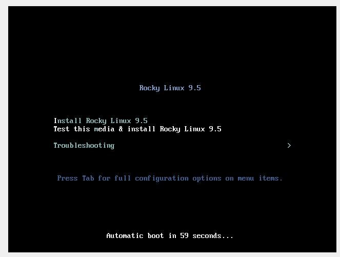{#fig:005 width=70%}

Переходим к настройкам установки операционной системы и выбираем английский язык для интерфейса (рис. [-@fig:006]).

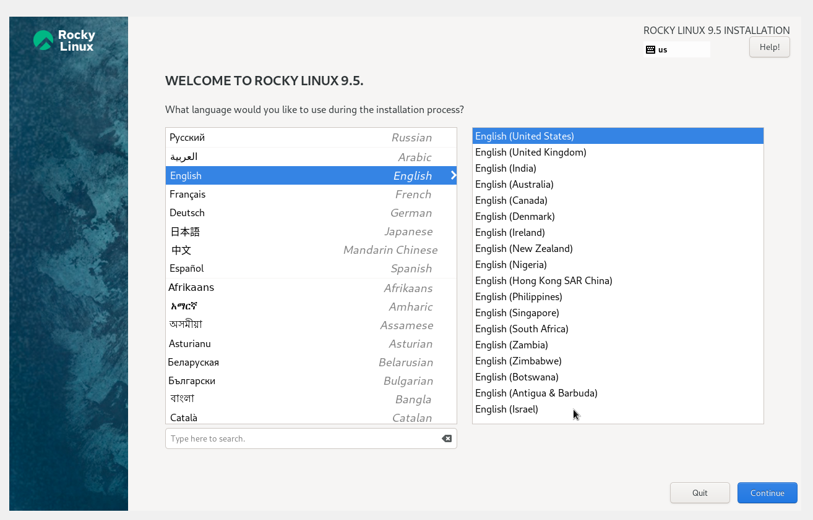{#fig:006 width=70%}

Добавляем русскую раскладку клавиатуры, меняем клавишу смены языка и проверяем работоспособность (рис. [-@fig:007]).

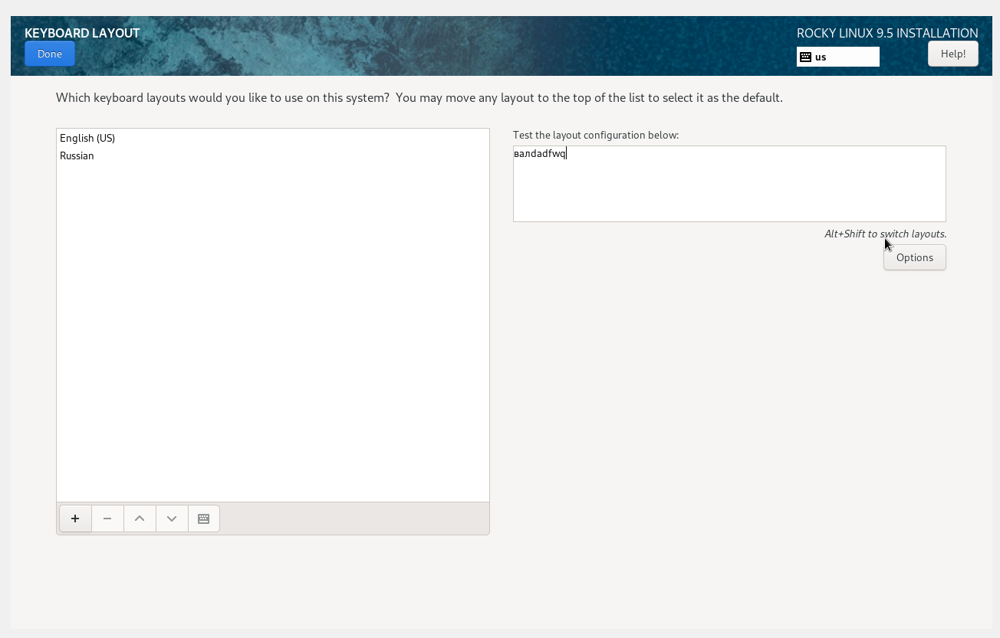{#fig:007 width=70%}

Проверяем что дата и время выбраны правильно (рис. [-@fig:008]).

{#fig:008 width=70%}

В разделе выбора программ указываем в качестве базового окружения Server with GUI, а в качестве дополнения — Development Tools (рис. [-@fig:009]).

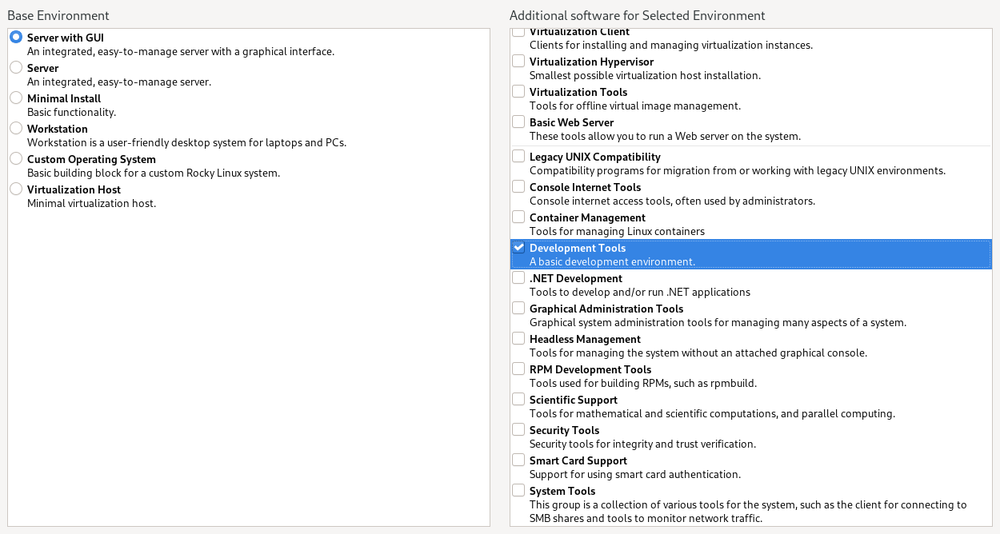{#fig:009 width=70%}

При выборе места установки оставляем те параметры, которые были выставлены автоматически (рис. [-@fig:010]).

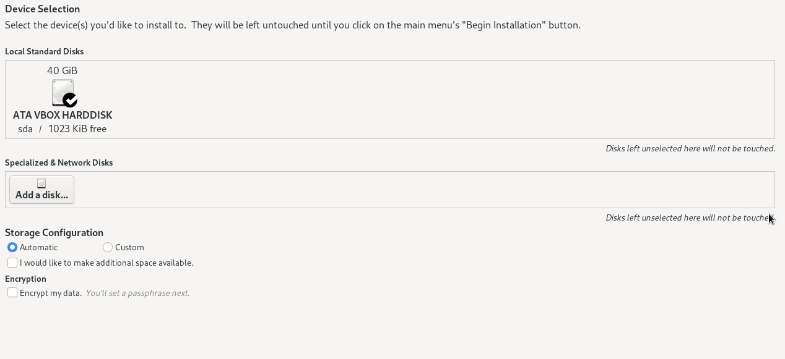{#fig:010 width=70%}

После этого отключаем KDUMP (рис. [-@fig:011]).

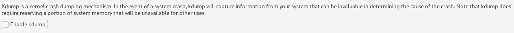{#fig:011 width=70%}

Подключаем сетевое соединение и в качестве имени узла указываем oskalashnikova.localdomaim (рис. [-@fig:012]).

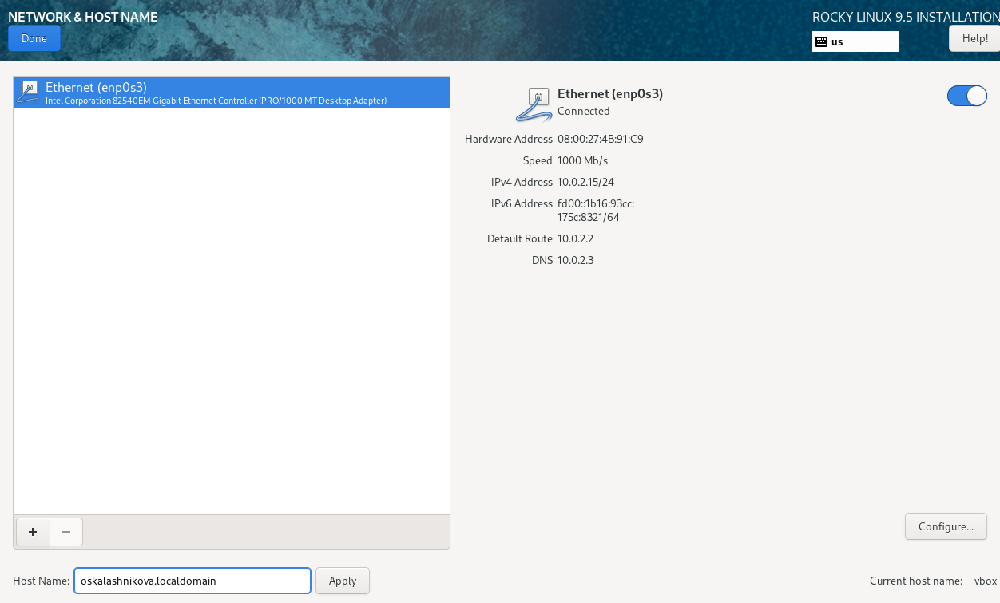{#fig:012 width=70%}

Устанавливаем пароль для root (рис. [-@fig:013]).

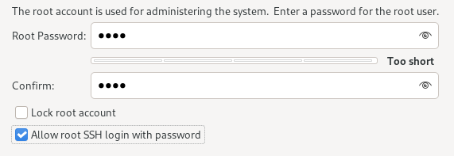{#fig:013 width=70%}

Устанавливаем пароль для пользователя с правами администратора (рис. [-@fig:014]).

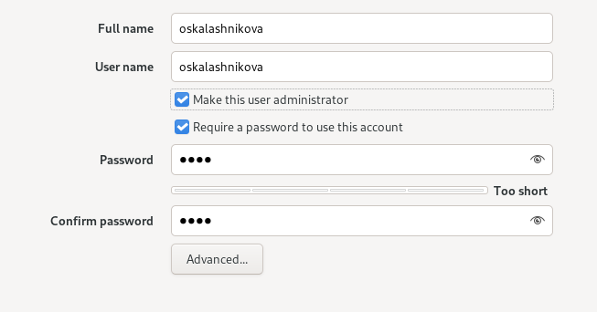{#fig:014 width=70%}

Проверяем всё ли выполнено и нажимаем начать установку(рис. [-@fig:015]).

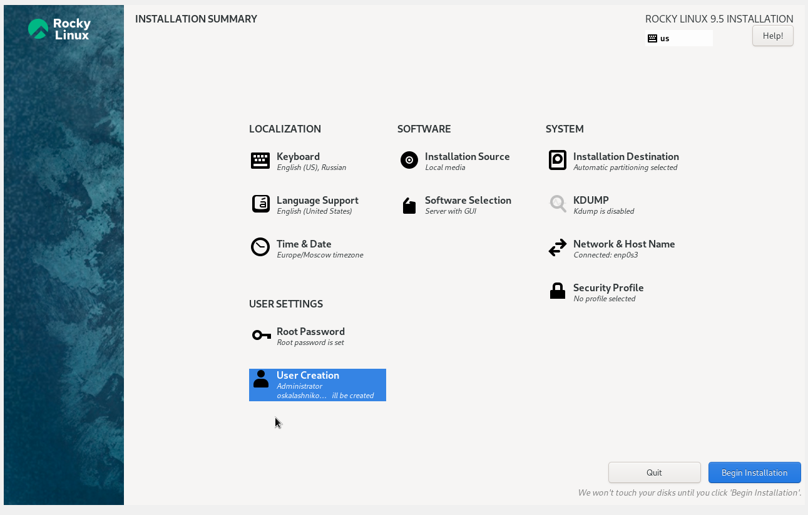{#fig:015 width=70%}

Устанавливаем ОС (рис. [-@fig:016]).

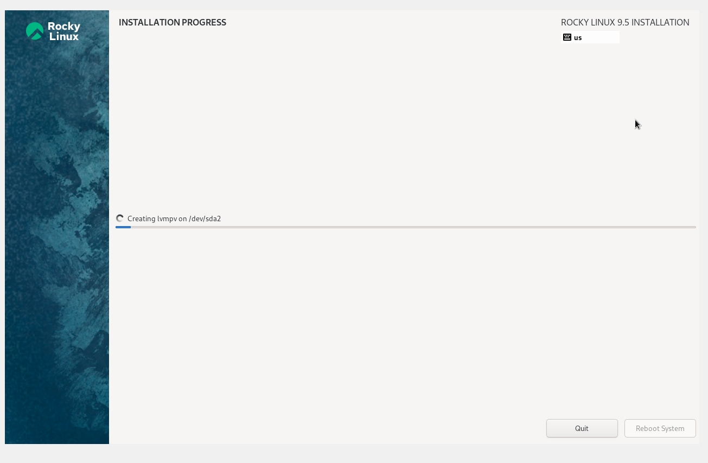{#fig:016 width=70%}

После успешной установки перезагружаем систему. Вход происходит по паролю который мы задали (рис. [-@fig:017]).

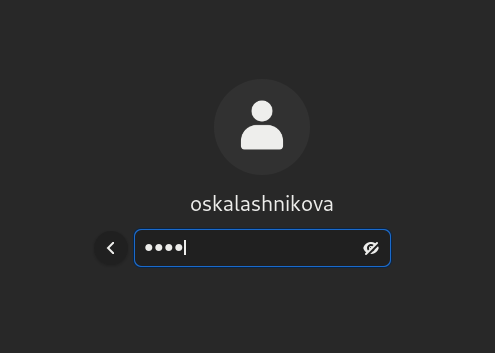{#fig:017 width=70%}

Проверяем вход в root, всё работает (рис. [-@fig:018]).

{#fig:018 width=70%}

Подключаем образ диска Дополнительной гостевой ОС (рис. [-@fig:019])

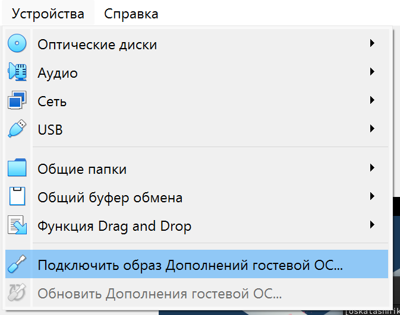{#fig:019 width=70%}

# Домашнее задание

В окне терминала проанализируем последовательность загрузки системы, выполнив команду dmesg (рис. [-@fig:020])

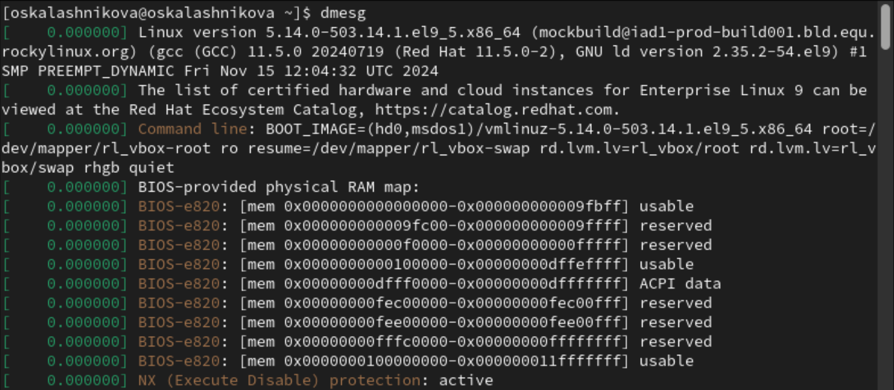{#fig:020 width=70%}

Далее посмотрим вывод этой команды с помошью dmesg | less (рис. [-@fig:021]), (рис. [-@fig:022])

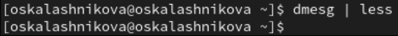{#fig:021 width=70%}

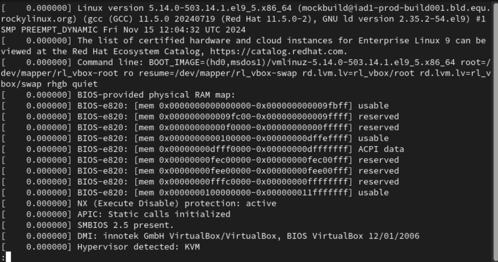{#fig:022 width=70%}

Далее получаем следующую информацию:

1. Версия ядра Linux (Linux version) (рис. [-@fig:023])

2. Частота процессора (Detected Mhz processor) (рис. [-@fig:024])

3. Модель процессора (CPU0) (рис. [-@fig:025])

4. Объем доступной оперативной памяти (Memory available) (рис. [-@fig:026])

5. Тип обнаруженного гипервизора (Hypervisor detected) (рис. [-@fig:027])

6. Тип файловой системы корневого раздела (рис. [-@fig:028])

7. Последовательность монтирования файловых систем (рис. [-@fig:029])

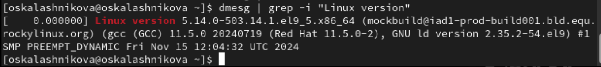{#fig:023 width=70%}

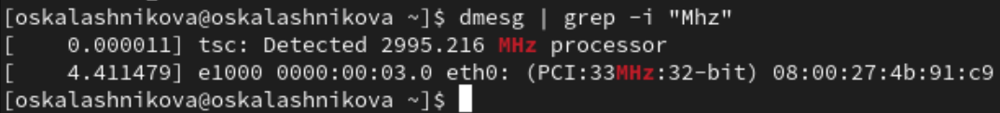{#fig:024 width=70%}

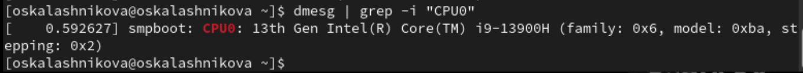{#fig:025 width=70%}

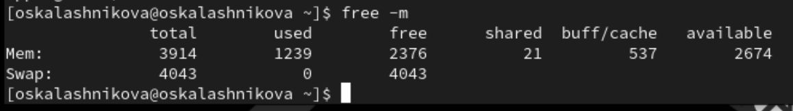{#fig:026 width=70%}

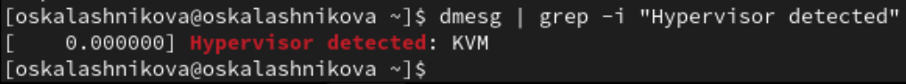{#fig:027 width=70%}

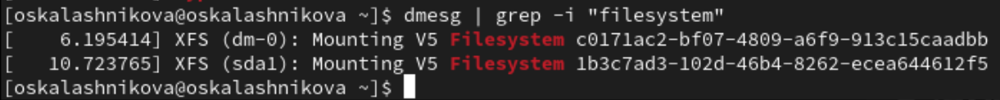{#fig:028 width=70%}

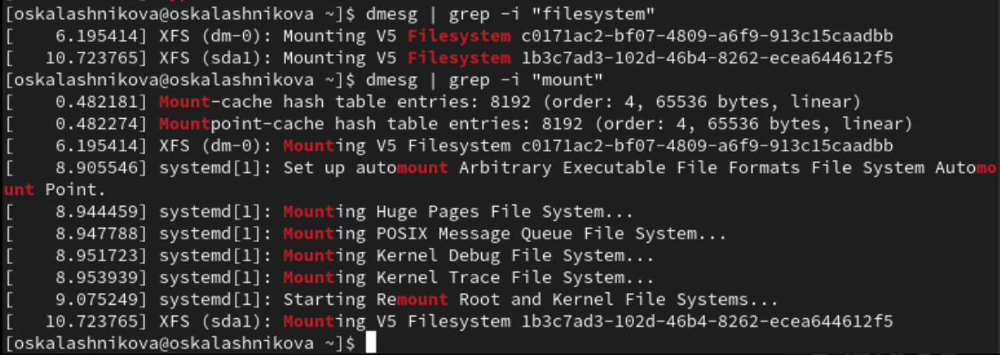{#fig:029 width=70%}

# Ответы на контрольные вопросы

1. Какую информацию содержит учётная запись пользователя?

- Имя пользователя (логин)
- UID (идентификатор пользователя)
- GID (идентификатор группы, к которой принадлежит пользователь)
- Полное имя (или комментарий)
- Пароль (обычно хранится в зашифрованном виде)
- Дата последнего входа
- Домашний каталог
- Команда по умолчанию для оболочки (например, /bin/bash)

2. Укажите команды терминала и приведите примеры

- Для получения справки по команде: man команда. Пример: man ls (открывает справку по команде ls).

- Для перемещения по файловой системе: cd путь. Пример: cd /home/user (перемещает в каталог пользователя).

- Для просмотра содержимого каталога: ls. Пример: ls -l (показывает содержимое с подробной информацией).

- Для задания определённых прав на файл / каталог: chmod права файл/каталог. Пример: chmod 755 script.sh (устанавливает права на выполнение для владельца и чтение для группы и других).

3. Что такое файловая система? Приведите примеры с краткой характеристикой.

Файловая система (англ. file system) — порядок, определяющий способ организации, хранения и именования данных во внешней памяти, и обеспечивающий пользователю удобный интерфейс при работе с такими данными. Простыми словами файловая система - это система хранения файлов и организации каталогов. От файловой системы зависит, как файлы будут кодироваться, храниться на диске и читаться компьютером.

Примеры:

- FAT (англ. File Allocation Table «таблица размещения файлов») — классическая архитектура файловой системы, которая из-за своей простоты всё ещё широко применяется для флеш-накопителей. Используется в дискетах, картах памяти и некоторых других носителях информации. Ранее находила применение и на жёстких дисках.

- NTFS (англ. new technology file system — «файловая система новой технологии») — стандартная файловая система для семейства операционных систем Windows NT фирмы Microsoft.

- Ext4 (англ. fourth extended file system, ext4fs) — журналируемая файловая система, используемая преимущественно в операционных системах с ядром Linux, созданная на базе ext3 в 2006 году.

4. Как посмотреть, какие файловые системы подмонтированы в ОС?

df

5. Как удалить зависший процесс?

kill с идентификатором (PID) процесса

# Выводы

В ходе выполнения лабораторной работы мной были приобретены практические навыки установки операционной системы на виртуальную машину и настройки минимально необходимых для дальнейшей работы сервисов.

# Список литературы{.unnumbered}

1. Лаборатораня работа №1 [Электронный ресурс] URL: https://esystem.rudn.ru/pluginfile.php/2580975/mod_folder/content/0/001-lab_virtualbox.pdf

2. VirtualBox [Электронный ресурс] URL: https://www.virtualbox.org/wiki/Linux_Downloads

3. Rocky Linux [Электронный ресурс] URL: https://rockylinux.org/ru-RU/download
