---
## Front matter
lang: ru-RU
title: "Лабораторная работа 2"
subtitle: Основы информационной безопасности.
author:
  - Калашникова Ольга Сергеевна
institute:
  - Российский университет дружбы народов, Москва, Россия
date: 8 марта 2025

## i18n babel
babel-lang: russian
babel-otherlangs: english

## Formatting pdf
toc: false
toc-title: Содержание
slide_level: 2
aspectratio: 169
section-titles: true
theme: metropolis
header-includes:
 - \metroset{progressbar=frametitle,sectionpage=progressbar,numbering=fraction}
 
## Fonts 
mainfont: PT Serif 
romanfont: PT Serif 
sansfont: PT Sans 
monofont: PT Mono 
mainfontoptions: Ligatures=TeX 
romanfontoptions: Ligatures=TeX 
sansfontoptions: Ligatures=TeX,Scale=MatchLowercase 
monofontoptions: Scale=MatchLowercase,Scale=0.9

---

## Цель работы

Целью данной работы является получение практических навыков работы в консоли с атрибутами файлов, закрепление теоретических основ дискреционного разграничения доступа в современных системах с открытым кодом на базе ОС Linux.

## Создание учётной записи пользователя guest

В установленной при выполнении предыдущей лабораторной работы операционной системе создаём учётную запись пользователя guest (используя учётную запись администратора) (рис.1)

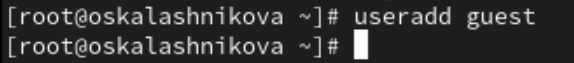{#fig:001 width=40%}

## Создание учётной записи пользователя guest

Зададим пароль для пользователя guest (рис.2)

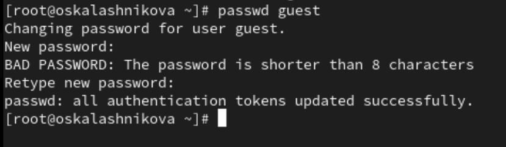{#fig:002 width=40%}

## Создание учётной записи пользователя guest

Далее зайдём в систему от имени пользователя guest (рис.3)

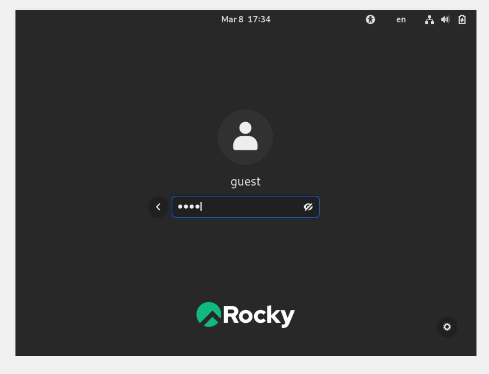{#fig:003 width=40%}

## После входа в систему от имени пользователя guest

Определим директорию, в которой мы находимся, при помощи команды *pwd* (рис.4)

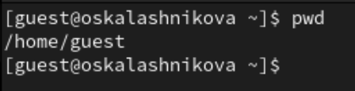{#fig:004 width=40%}

## После входа в систему от имени пользователя guest

Уточним имя пользователя при помощи команды *whoami* (рис.5)

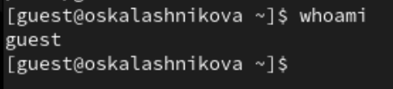{#fig:005 width=40%}

## После входа в систему от имени пользователя guest

Далее уточним имя пользователя, его группу, а также группы, куда входит пользователь, командой *id* (рис.6)

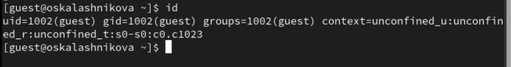{#fig:006 width=40%}  

## После входа в систему от имени пользователя guest

Далее сравним вывод команды *id* с выводом команды *groups*. В выводе команды *groups* информация только о названии группы, к которой относится пользователь. В выводе команды *id* больше информации: имя пользователя и имя группы, также коды имени пользователя и группы (рис.7)

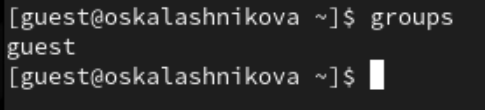{#fig:007 width=40%} 

## После входа в систему от имени пользователя guest

Посмотрим файл /etc/passwd при помощи команды *cat /etc/passwd & grep guest*, чтобы найти в нём информацию об учётной записи пользователя guest, определить его uid и gid. Найденные значение совпадают с полученными в предыдущих выводах (рис.8)

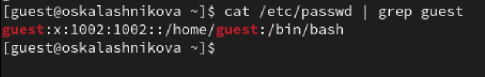{#fig:008 width=40%} 

## После входа в систему от имени пользователя guest

Определим существующие в системе директории командой *ls -l /home/*. Нам удалось получить список поддиректорий директории /home. Права у директорий oskalashnikova и guest: *drwx------* (рис.9)

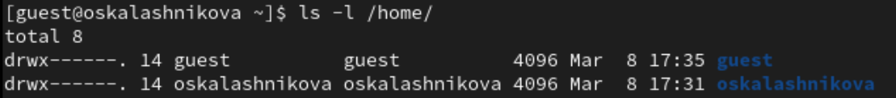{#fig:009 width=40%} 

## После входа в систему от имени пользователя guest

Проверим, какие расширенные атрибуты установлены на поддиректориях, находящихся в директории /home, командой:*lsattr /home*. Увидеть расширенные атрибуты директории не удалось.(рис.10)

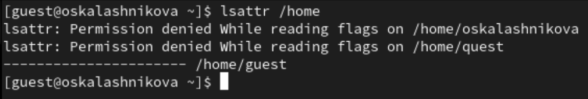{#fig:010 width=40%}

## После входа в систему от имени пользователя guest

Можно увидеть расширенные атрибуты директорий других пользователей при помощи команды *lsattr /home/guest* (рис. 11)

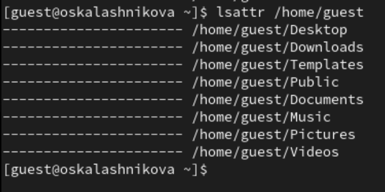{#fig:011 width=40%}  

## После входа в систему от имени пользователя guest

Далее создадим в домашней директории поддиректорию dir1 командой *mkdir dir1* (рис.12)

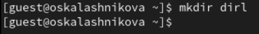{#fig:012 width=40%}  

## После входа в систему от имени пользователя guest

Определим при помощи команды *ls -l*, какие права доступа были выставлены на директорию dir1 (рис.13) 

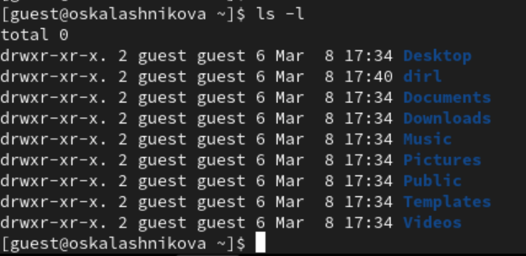{#fig:013 width=40%}  

## После входа в систему от имени пользователя guest

Определим при помощи команды *lsattr*, какие расширенные атрибуты были выставлены на директорию dir1 (рис.14) 

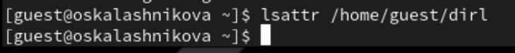{#fig:014 width=40%}  

## После входа в систему от имени пользователя guest

Снимем с директории dir1 все атрибуты при помощи команды *chmod 000 dir1* (рис.15)

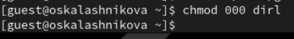{#fig:015 width=40%}  

## После входа в систему от имени пользователя guest

Проверим при помощи команды *ls -l* (рис.16)

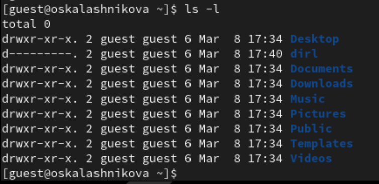{#fig:016 width=40%}  

## После входа в систему от имени пользователя guest

Попытаемся создать в директории dir1 файл file1 командой *echo "test" > /home/guest/dir1/file1*. Мы не сможем создать файл, так как у директории недостаточно прав для создания файлов (рис.17)

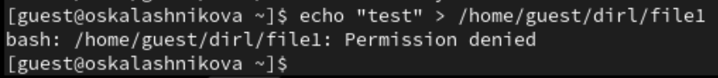{#fig:017 width=40%}

## После входа в систему от имени пользователя guest

Далее проверим командой *ls -l /home/guest/dir1* создался ли файл. Мы сможем этого сделать, так как у директории не достаточно прав. (рис.18)

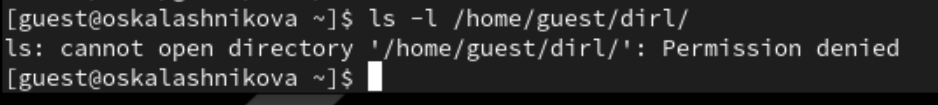{#fig:018 width=40%}

## После входа в систему от имени пользователя guest

Изменим атрибуты директории dir1 на 700 и проверим на наличие файла. Как мы видим файл не создался (рис.19)

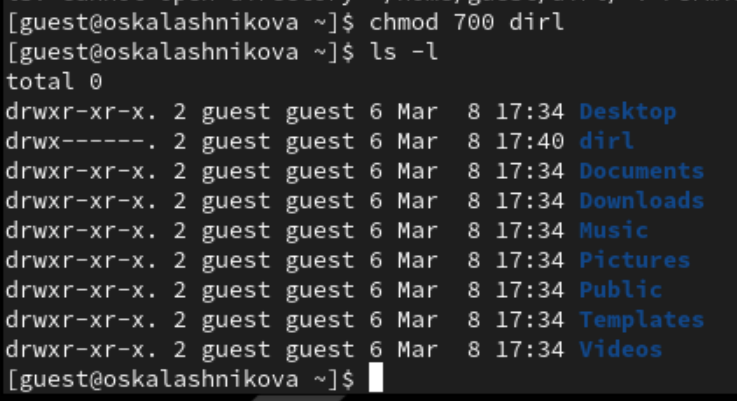{#fig:019 width=40%}

## Выводы

В ходе выполнения лабораторной работы мы получили практические навыки работы в консоли с атрибутами файлов, закрепили теоретические основы дискреционного разграничения доступа в современных системах с открытым кодом на базе ОС Linux.

## Список литературы

1. Лаборатораня работа №2 [Электронный ресурс] URL: https://esystem.rudn.ru/pluginfile.php/2580978/mod_resource/content/6/002-lab_discret_attr.pdf
