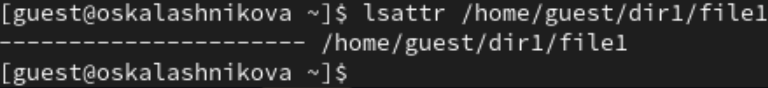
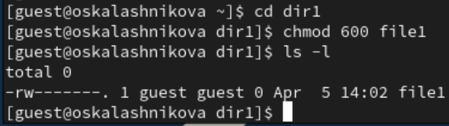
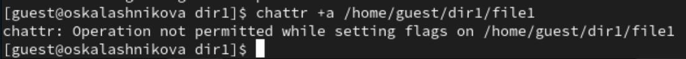
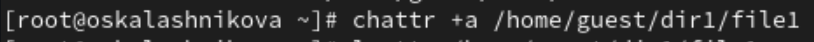
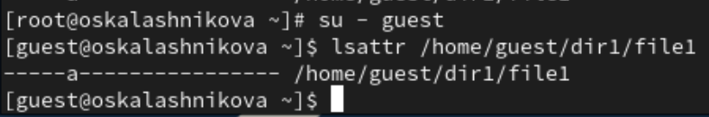
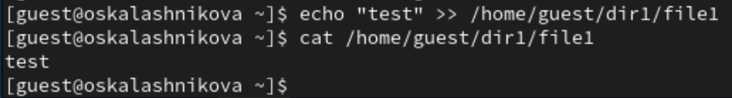
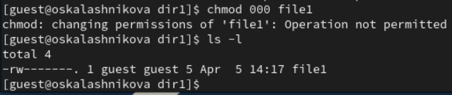
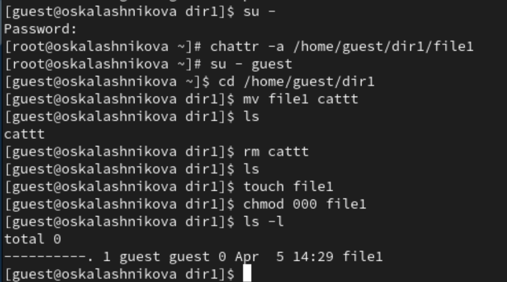
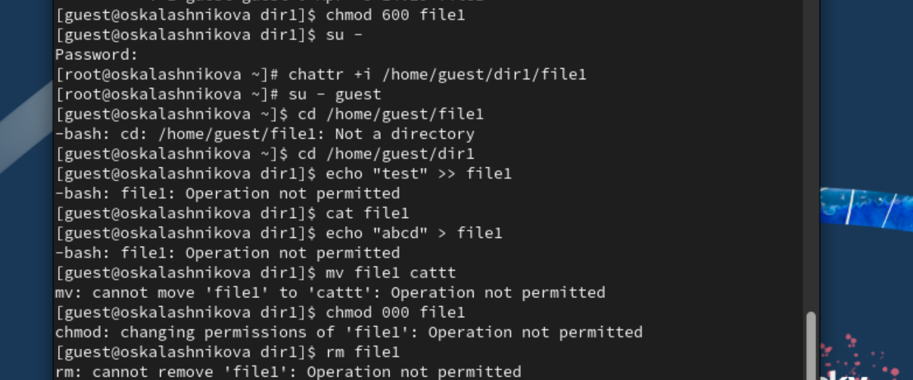

---
## Front matter
lang: ru-RU
title: "Лабораторная работа 4"
subtitle: Основы информационной безопасности.
author:
  - Калашникова Ольга Сергеевна
institute:
  - Российский университет дружбы народов, Москва, Россия
date: 5 апреля 2025

## i18n babel
babel-lang: russian
babel-otherlangs: english

## Formatting pdf
toc: false
toc-title: Содержание
slide_level: 2
aspectratio: 169
section-titles: true
theme: metropolis
header-includes:
 - \metroset{progressbar=frametitle,sectionpage=progressbar,numbering=fraction}
 
## Fonts 
mainfont: PT Serif 
romanfont: PT Serif 
sansfont: PT Sans 
monofont: PT Mono 
mainfontoptions: Ligatures=TeX 
romanfontoptions: Ligatures=TeX 
sansfontoptions: Ligatures=TeX,Scale=MatchLowercase 
monofontoptions: Scale=MatchLowercase,Scale=0.9

---

## Цель работы

Получение практических навыков работы в консоли с расширенными атрибутами файлов.

## Выполнение лабораторной работы

От имени пользователя guest определяем расширенные атрибуты файла /home/guest/dir1/file1 командой lsattr /home/guest/dir1/file1 (рис.1)

{#fig:001 width=50%}

## Выполнение лабораторной работы

Установим командой chmod 600 file1 на файл file1 права, разрешающие чтение и запись для владельца файла (рис.2)

{#fig:002 width=50%}

## Выполнение лабораторной работы

Попробуем установить на файл /home/guest/dir1/file1 расширенный атрибут a от имени пользователя guest с помощью команды chattr +a /home/guest/dir1/file1. В ответ мы получили отказ от выполнения операции (рис.3)

{#fig:003 width=50%}

## Выполнение лабораторной работы

Повысим свои права с помощью команды su - и установим расширенный атрибут a на файл /home/guest/dir1/file1 от имени суперпользователя при помощи команды chattr +a /home/guest/dir1/file1 (рис. 4)

{#fig:004 width=40%}

## Выполнение лабораторной работы

От пользователя guest проверим правильность установления атрибута при помощи команды lsattr /home/guest/dir1/file1 (рис. 5)

{#fig:005 width=50%}

## Выполнение лабораторной работы

Выполним дозапись в файл file1 слова «test» командой echo "test" /home/guest/dir1/file1. После этого выполним чтение файла file1 командой cat /home/guest/dir1/file1, чтобы убедиться, что слово test было успешно записано в file1 (рис.6)

{#fig:006 width=60%}

## Выполнение лабораторной работы

Пробуем удалить файл file1 и переименовать его. Ничего не получилось из-за заданного атрибута (рис. 7)

{#fig:007 width=40%}

## Выполнение лабораторной работы

Попробуем с помощью команды chmod 000 file1 установить на файл file1 права, запрещающие чтение и запись для владельца файла. Данная команда так же не работает (рис.8)

{#fig:008 width=40%}

## Выполнение лабораторной работы

Снимем расширенный атрибут a с файла /home/guest/dirl/file1 от имени суперпользователя командой chattr -a /home/guest/dir1/file1 и повторим операции, которые ранее не удавалось выполнить. В файл с атрибутом а можно только добавлять новые данные. Старое содержимое изменить или удалить не получится. (рис. 9)

{#fig:009 width=30%} 

## Выполнение лабораторной работы

Повторим действия по шагам, заменив атрибут «a» атрибутом «i». Как мы можем заметить, с атрибутом i файл становится неуязвим для любых изменений. Его нельзя удалить, переименовать, изменить содержимое.(рис.10)

{#fig:010 width=40%}

## Выводы

В ходе выполнения лабораторной работы мы повысили свои навыки использования интерфейса командой строки (CLI), познакомились на примерах с тем, как используются основные и расширенные атрибуты при разграничении доступа и опробовали действие на практике расширенных атрибутов «а» и «i».

## Список литературы

1. Лаборатораня работа №4 [Электронный ресурс] URL: https://esystem.rudn.ru/pluginfile.php/2580982/mod_resource/content/3/004-lab_discret_extattr.pdf
