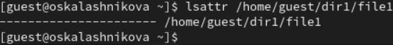
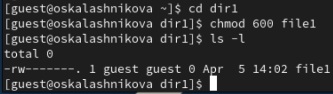
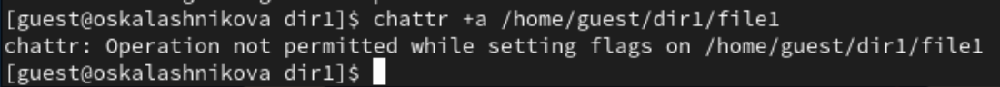
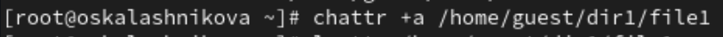
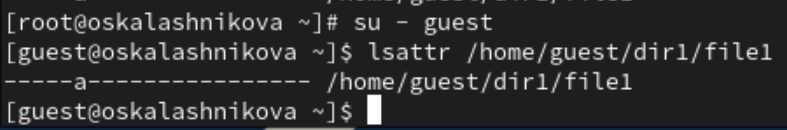
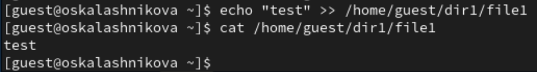
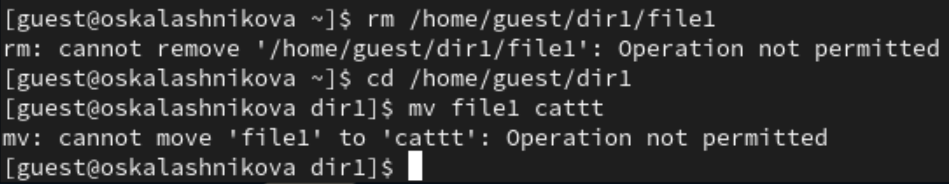
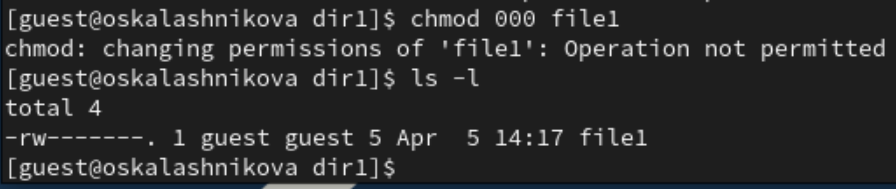
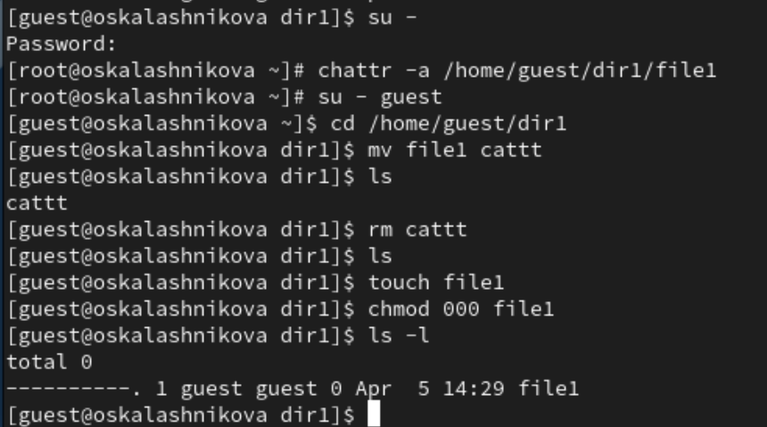

---
## Front matter
title: "Отчёт по лабораторной работе №4"
subtitle: "Дисциплина: Основы информационной безопасности"
author: "Калашникова Ольга Сергеевна"

## Generic otions
lang: ru-RU
toc-title: "Содержание"

## Bibliography
bibliography: bib/cite.bib
csl: pandoc/csl/gost-r-7-0-5-2008-numeric.csl

## Pdf output format
toc: true # Table of contents
toc-depth: 2
lof: true # List of figures
lot: true # List of tables
fontsize: 12pt
linestretch: 1.5
papersize: a4
documentclass: scrreprt
## I18n polyglossia
polyglossia-lang:
  name: russian
  options:
	- spelling=modern
	- babelshorthands=true
polyglossia-otherlangs:
  name: english
## I18n babel
babel-lang: russian
babel-otherlangs: english
## Fonts
mainfont: PT Serif
romanfont: PT Serif
sansfont: PT Sans
monofont: PT Mono
mainfontoptions: Ligatures=TeX
romanfontoptions: Ligatures=TeX
sansfontoptions: Ligatures=TeX,Scale=MatchLowercase
monofontoptions: Scale=MatchLowercase,Scale=0.9
## Biblatex
biblatex: true
biblio-style: "gost-numeric"
biblatexoptions:
  - parentracker=true
  - backend=biber
  - hyperref=auto
  - language=auto
  - autolang=other*
  - citestyle=gost-numeric
## Pandoc-crossref LaTeX customization
figureTitle: "Рис."
tableTitle: "Таблица"
listingTitle: "Листинг"
lofTitle: "Список иллюстраций"
lotTitle: "Список таблиц"
lolTitle: "Листинги"
## Misc options
indent: true
header-includes:
  - \usepackage{indentfirst}
  - \usepackage{float} # keep figures where there are in the text
  - \floatplacement{figure}{H} # keep figures where there are in the text
---

# Цель работы

Получение практических навыков работы в консоли с расширенными атрибутами файлов.

# Выполнение лабораторной работы

От имени пользователя guest определяем расширенные атрибуты файла /home/guest/dir1/file1 командой lsattr /home/guest/dir1/file1 (рис. [-@fig:001])

{#fig:001 width=70%}

Установим командой chmod 600 file1 на файл file1 права, разрешающие чтение и запись для владельца файла (рис. [-@fig:002])

{#fig:002 width=70%}

Попробуем установить на файл /home/guest/dir1/file1 расширенный атрибут a от имени пользователя guest с помощью команды chattr +a /home/guest/dir1/file1. В ответ мы получили отказ от выполнения операции (рис. [-@fig:003])

{#fig:003 width=70%}

Повысим свои права с помощью команды su - и установим расширенный атрибут a на файл /home/guest/dir1/file1 от имени суперпользователя при помощи команды chattr +a /home/guest/dir1/file1 (рис. [-@fig:004])

{#fig:004 width=70%}

От пользователя guest проверим правильность установления атрибута при помощи команды lsattr /home/guest/dir1/file1 (рис. [-@fig:005])

{#fig:005 width=70%}

Выполним дозапись в файл file1 слова «test» командой echo "test" /home/guest/dir1/file1. После этого выполним чтение файла file1 командой cat /home/guest/dir1/file1, чтобы убедиться, что слово test было успешно записано в file1 (рис. [-@fig:006])

{#fig:006 width=70%}

Пробуем удалить файл file1 и переименовать его. Ничего не получилось из-за заданного атрибута (рис. [-@fig:007])

{#fig:007 width=70%}

Попробуем с помощью команды chmod 000 file1 установить на файл file1 права, запрещающие чтение и запись для владельца файла. Данная команда так же не работает (рис. [-@fig:008])

{#fig:008 width=70%}

Снимем расширенный атрибут a с файла /home/guest/dirl/file1 от имени суперпользователя командой chattr -a /home/guest/dir1/file1 и повторим операции, которые ранее не удавалось выполнить. В файл с атрибутом а можно только добавлять новые данные. Старое содержимое изменить или удалить не получится. (рис. [-@fig:009])

{#fig:009 width=70%} 

Повторим действия по шагам, заменив атрибут «a» атрибутом «i». Как мы можем заметить, с атрибутом i файл становится неуязвим для любых изменений. Его нельзя удалить, переименовать, изменить содержимое.(рис. [-@fig:010])

{#fig:010 width=70%}

# Выводы

В ходе выполнения лабораторной работы мы повысили свои навыки использования интерфейса командой строки (CLI), познакомились на примерах с тем, как используются основные и расширенные атрибуты при разграничении доступа и опробовали действие на практике расширенных атрибутов «а» и «i».

# Список литературы

1. Лаборатораня работа №4 [Электронный ресурс] URL: https://esystem.rudn.ru/pluginfile.php/2580982/mod_resource/content/3/004-lab_discret_extattr.pdf
