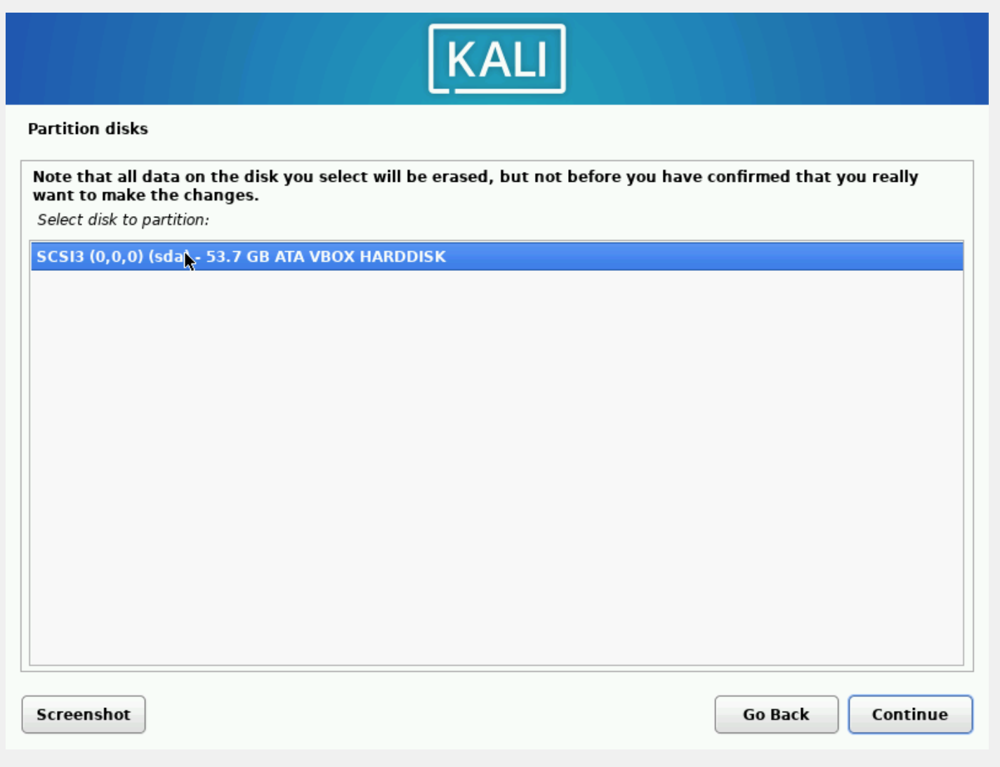

---
## Front matter
title: "Отчёт по выполнению 1-го этапа индивидуального проекта"
subtitle: "Дисциплина: Основы информационной безопасности"
author: "Калашникова Ольга Сергеевна"

## Generic otions
lang: ru-RU
toc-title: "Содержание"

## Bibliography
bibliography: bib/cite.bib
csl: pandoc/csl/gost-r-7-0-5-2008-numeric.csl

## Pdf output format
toc: true # Table of contents
toc-depth: 2
lof: true # List of figures
lot: true # List of tables
fontsize: 12pt
linestretch: 1.5
papersize: a4
documentclass: scrreprt
## I18n polyglossia
polyglossia-lang:
  name: russian
  options:
	- spelling=modern
	- babelshorthands=true
polyglossia-otherlangs:
  name: english
## I18n babel
babel-lang: russian
babel-otherlangs: english
## Fonts
mainfont: PT Serif
romanfont: PT Serif
sansfont: PT Sans
monofont: PT Mono
mainfontoptions: Ligatures=TeX
romanfontoptions: Ligatures=TeX
sansfontoptions: Ligatures=TeX,Scale=MatchLowercase
monofontoptions: Scale=MatchLowercase,Scale=0.9
## Biblatex
biblatex: true
biblio-style: "gost-numeric"
biblatexoptions:
  - parentracker=true
  - backend=biber
  - hyperref=auto
  - language=auto
  - autolang=other*
  - citestyle=gost-numeric
## Pandoc-crossref LaTeX customization
figureTitle: "Рис."
tableTitle: "Таблица"
listingTitle: "Листинг"
lofTitle: "Список иллюстраций"
lotTitle: "Список таблиц"
lolTitle: "Листинги"
## Misc options
indent: true
header-includes:
  - \usepackage{indentfirst}
  - \usepackage{float} # keep figures where there are in the text
  - \floatplacement{figure}{H} # keep figures where there are in the text
---

# Цель работы

Целью данной работы является установка Kali Linux на виртуальную машину.

# Выполнение 1-го этапа индивидуального проекта

Перед началом выполнения лабораторной работы, скачиваем необходимый дистрибутив, воспользовавшись сайтом (рис. [-@fig:001]).

{#fig:001 width=70%}

Открываем VirtualBox и создаём новую виртуальную машину. Указываем имя виртуальной машины, определяем тип операционной системы и указываем путь к iso-образу (рис. [-@fig:002]).

{#fig:002 width=70%}

Указываем объем объём основной памяти - 4096МБ, и количество процессоров - 3 (рис. [-@fig:003]).

{#fig:003 width=70%}

В размере виртуального жёсткого диска указываем 50 Гб (рис. [-@fig:004]).

{#fig:004 width=70%}

Запускаем виртуальную машину и выбираем Graphical install (рис. [-@fig:005]).

{#fig:005 width=70%}

Переходим к настройкам установки операционной системы и выбираем английский язык для интерфейса (рис. [-@fig:006]).

{#fig:006 width=70%}

Выбираем местонахождение (рис. [-@fig:007]).

{#fig:007 width=70%}

Добавляем русскую раскладку клавиатуры (рис. [-@fig:008]).

{#fig:008 width=70%}

Указываем способ переключения клавиатуры Alt+Shift (рис. [-@fig:009]).

{#fig:009 width=70%}

Подключаем сетевое соединение и в качестве имени компьютера указываем oskalashnikova (рис. [-@fig:010]).

{#fig:010 width=70%}

В качестве имени домена указываем oskalashnikova (рис. [-@fig:011]).

{#fig:011 width=70%}

Устанавливаем полное имя нового пользователя (рис. [-@fig:012]).

{#fig:012 width=70%}

Устанавливаем имя учетной записи (рис. [-@fig:013]).

{#fig:013 width=70%}

Устанавливаем пароль для пользователя (рис. [-@fig:014]).

{#fig:014 width=70%}

Выбираем часовой пояс (рис. [-@fig:015]).

{#fig:015 width=70%}

Выбираем использовать весь диск (рис. [-@fig:016]).

{#fig:016 width=70%}

Выбираем нужный диск для разметки (рис. [-@fig:017]).

{#fig:017 width=70%}

Оставляем рекомендованную схему разметки (рис. [-@fig:018]).

{#fig:018 width=70%}

Заканчиваем разметку и записываем изменения на диск (рис. [-@fig:019]).

{#fig:019 width=70%}

Подтверждаем запись изменения на диск (рис. [-@fig:020]).

{#fig:020 width=70%}

Выбираем программное обеспечение (рис. [-@fig:021]).

{#fig:021 width=70%}

Установка системного загрузчика GRUB (рис. [-@fig:022]).

{#fig:022 width=70%}

Выбираем устройство для установки системного загрузчика GRUB (рис. [-@fig:023]).

{#fig:023 width=70%}

Завершаем установку (рис. [-@fig:024]).

{#fig:024 width=70%}

Для проверки удачности установки запускаем виртуальную машину и входим в учетную запись (рис. [-@fig:025]).

{#fig:025 width=70%}

Проверяем что всё успешно работает (рис. [-@fig:026]).

{#fig:026 width=70%}

# Выводы

В ходе выполнения 1-го этапа индивидуального проекта я установила дистрибутив Kali Linux на виртуальную машину.

# Список литературы{.unnumbered}

1. Этапы реализации проекта [Электронный ресурс] URL: https://esystem.rudn.ru/mod/page/view.php?id=1220336

2. VirtualBox [Электронный ресурс] URL: https://www.virtualbox.org/wiki/Linux_Downloads

3. Kali Linux [Электронный ресурс] URL: https://www.kali.org/get-kali/#kali-platforms
