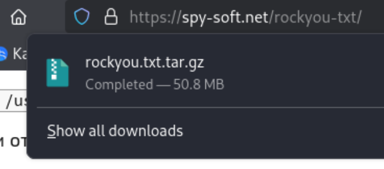
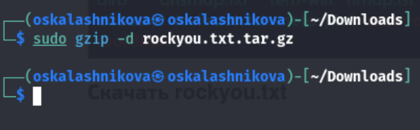
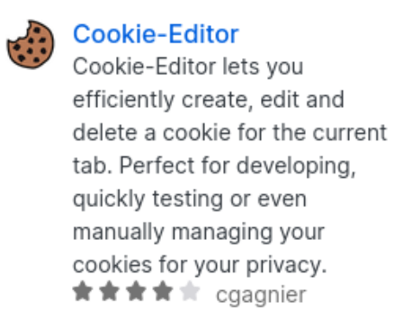
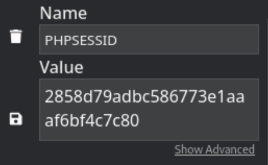
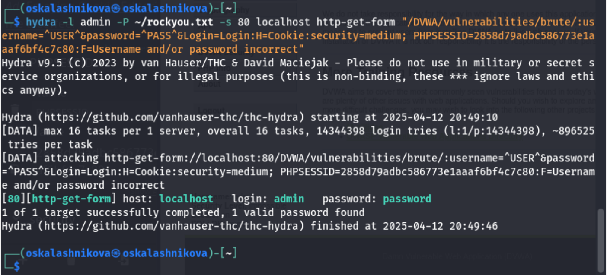

---
## Front matter
lang: ru-RU
title: "Отчёт по выполнению 3-ого этапа индивидуального проекта"
subtitle: Основы информационной безопасности.
author:
  - Калашникова Ольга Сергеевна
institute:
  - Российский университет дружбы народов, Москва, Россия
date: 12 апреля 2025

## i18n babel
babel-lang: russian
babel-otherlangs: english

## Formatting pdf
toc: false
toc-title: Содержание
slide_level: 2
aspectratio: 169
section-titles: true
theme: metropolis
header-includes:
 - \metroset{progressbar=frametitle,sectionpage=progressbar,numbering=fraction}
 
## Fonts 
mainfont: PT Serif 
romanfont: PT Serif 
sansfont: PT Sans 
monofont: PT Mono 
mainfontoptions: Ligatures=TeX 
romanfontoptions: Ligatures=TeX 
sansfontoptions: Ligatures=TeX,Scale=MatchLowercase 
monofontoptions: Scale=MatchLowercase,Scale=0.9

---

## Цель работы

Приобретение практических навыков по использованию инструмента Hydra для бутфорса паролей

## Распаковка архива с паролями

Скачаем стандартный список паролей rockyou.txt для kali linux (рис.1)

{#fig:001 width=50%}

## Распаковка архива с паролями

Далее распакуем архив командой *sudo gzip -d*.  (рис.2)

{#fig:002 width=50%}

## Настройка cookie

Зайдём на сайт DVWA, который был получен в ходе предыдущего этапа индивидуального проекта. Для запроса hydra, который мы будем использовать позже, нам понадобятся параметры cookie с этого сайта. Для того чтобы получить информацию о параметрах cookie надо установить расширение для браузера  (рис.3)

{#fig:003 width=50%}

## Настройка cookie

Теперь мы можем скопировать параметры cookie(рис.4)

{#fig:004 width=50%}

## Запрос к hydra

Теперь вводим в hydra запрос нужную информацию. Пароль будем подбирать для пользователя admin, используя get-запрос с двумя параметрами cookie (security и PHPSESSID). Спустя время появится результат с подходящим паролем. Мы видим что это правильный пароль (рис.5)

{#fig:005 width=50%}

## Выводы
 
В ходе выполнения 3-ого этапа индивидуального проекта мы приобрели практические навыки работы по использованию инструмента hydra для бутфорса паролей.
