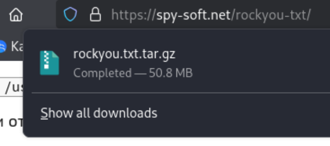
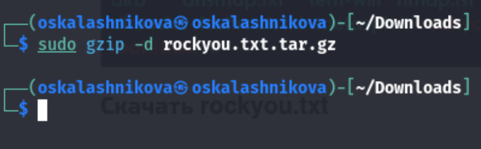
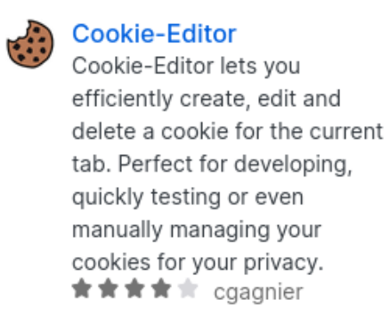
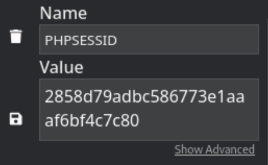
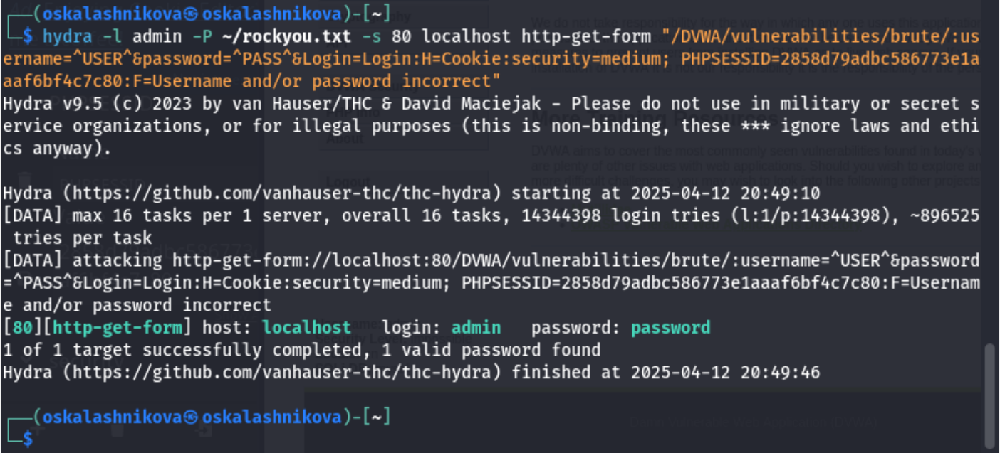

---
## Front matter
title: "Отчёт по выполнению 3-ого этапа индивидуального проекта"
subtitle: "Дисциплина: Основы информационной безопасности"
author: "Калашникова Ольга Сергеевна"

## Generic otions
lang: ru-RU
toc-title: "Содержание"

## Bibliography
bibliography: bib/cite.bib
csl: pandoc/csl/gost-r-7-0-5-2008-numeric.csl

## Pdf output format
toc: true # Table of contents
toc-depth: 2
lof: true # List of figures
lot: true # List of tables
fontsize: 12pt
linestretch: 1.5
papersize: a4
documentclass: scrreprt
## I18n polyglossia
polyglossia-lang:
  name: russian
  options:
	- spelling=modern
	- babelshorthands=true
polyglossia-otherlangs:
  name: english
## I18n babel
babel-lang: russian
babel-otherlangs: english
## Fonts
mainfont: PT Serif
romanfont: PT Serif
sansfont: PT Sans
monofont: PT Mono
mainfontoptions: Ligatures=TeX
romanfontoptions: Ligatures=TeX
sansfontoptions: Ligatures=TeX,Scale=MatchLowercase
monofontoptions: Scale=MatchLowercase,Scale=0.9
## Biblatex
biblatex: true
biblio-style: "gost-numeric"
biblatexoptions:
  - parentracker=true
  - backend=biber
  - hyperref=auto
  - language=auto
  - autolang=other*
  - citestyle=gost-numeric
## Pandoc-crossref LaTeX customization
figureTitle: "Рис."
tableTitle: "Таблица"
listingTitle: "Листинг"
lofTitle: "Список иллюстраций"
lotTitle: "Список таблиц"
lolTitle: "Листинги"
## Misc options
indent: true
header-includes:
  - \usepackage{indentfirst}
  - \usepackage{float} # keep figures where there are in the text
  - \floatplacement{figure}{H} # keep figures where there are in the text
---

# Цель работы

Приобретение практических навыков по использованию инструмента Hydra для бутфорса паролей

# Выполнение 3-ого этапа индивидуального проекта

## Распаковка архива с паролями

Скачаем стандартный список паролей rockyou.txt для kali linux (рис. [-@fig:001])

{#fig:001 width=70%}

Далее распакуем архив командой *sudo gzip -d*.  (рис. [-@fig:002])

{#fig:002 width=70%}

## Настройка cookie

Зайдём на сайт DVWA, который был получен в ходе предыдущего этапа индивидуального проекта. Для запроса hydra, который мы будем использовать позже, нам понадобятся параметры cookie с этого сайта. Для того чтобы получить информацию о параметрах cookie надо установить расширение для браузера  (рис. [-@fig:003])

{#fig:003 width=70%}

Теперь мы можем скопировать параметры cookie(рис. [-@fig:004])

{#fig:004 width=70%}

## Запрос к hydra

Теперь вводим в hydra запрос нужную информацию. Пароль будем подбирать для пользователя admin, используя get-запрос с двумя параметрами cookie (security и PHPSESSID). Спустя время появится результат с подходящим паролем. Мы видим что это правильный пароль (рис. [-@fig:005])

{#fig:005 width=70%}

# Выводы
 
В ходе выполнения 3-ого этапа индивидуального проекта мы приобрели практические навыки работы по использованию инструмента hydra для бутфорса паролей.

# Список литературы

1. Этапы реализации проекта [Электронный ресурс] URL: https://esystem.rudn.ru/mod/page/view.php?id=1220336
2. Словарь Rockyou.txt где находится в Kali Linux и как скачать [Электронный ресурс] URL: https://spy-soft.net/rockyou-txt/
3. How to Brute Force Attack on Web Forms? [Step-by-Step] [Электронный ресурс] URL: https://www.golinuxcloud.com/brute-force-attack-web-forms/
4. Расширение Cookie-Editor [Step-by-Step] [Электронный ресурс] URL: https://addons.mozilla.org/en-US/firefox/addon/cookie-editor/?utm_campaign=external-cookie-editor.com
